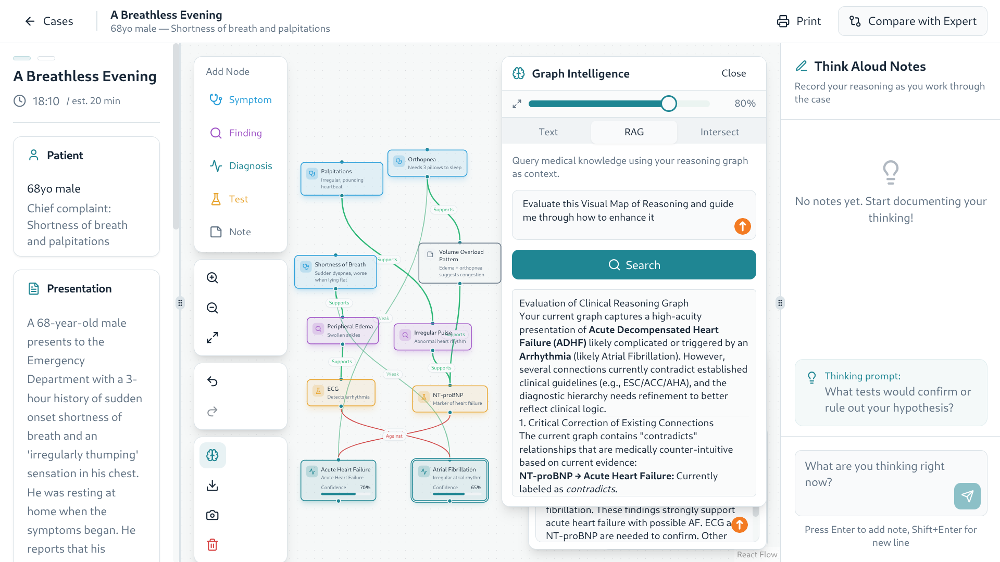
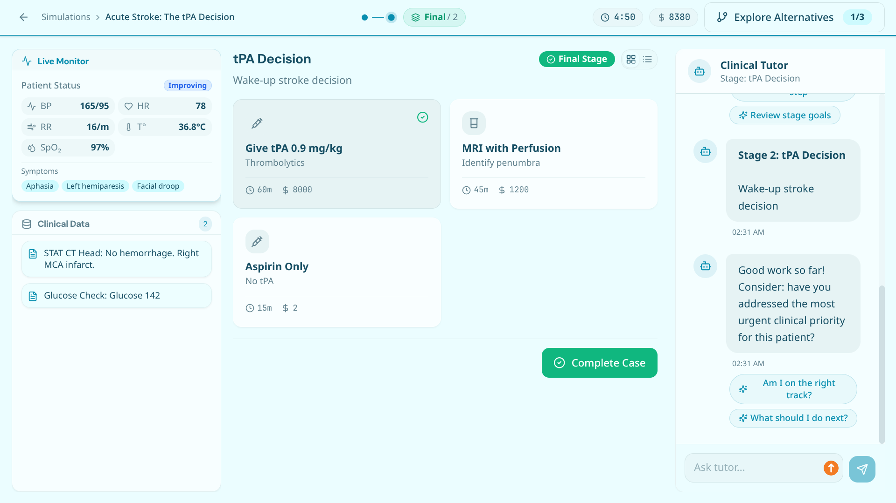
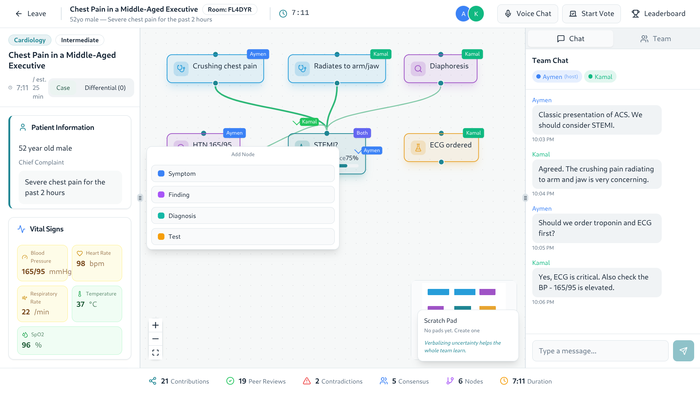
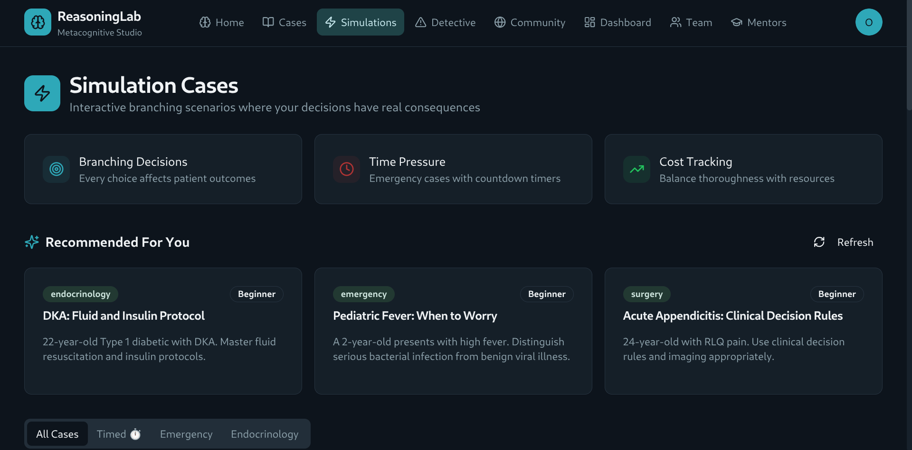
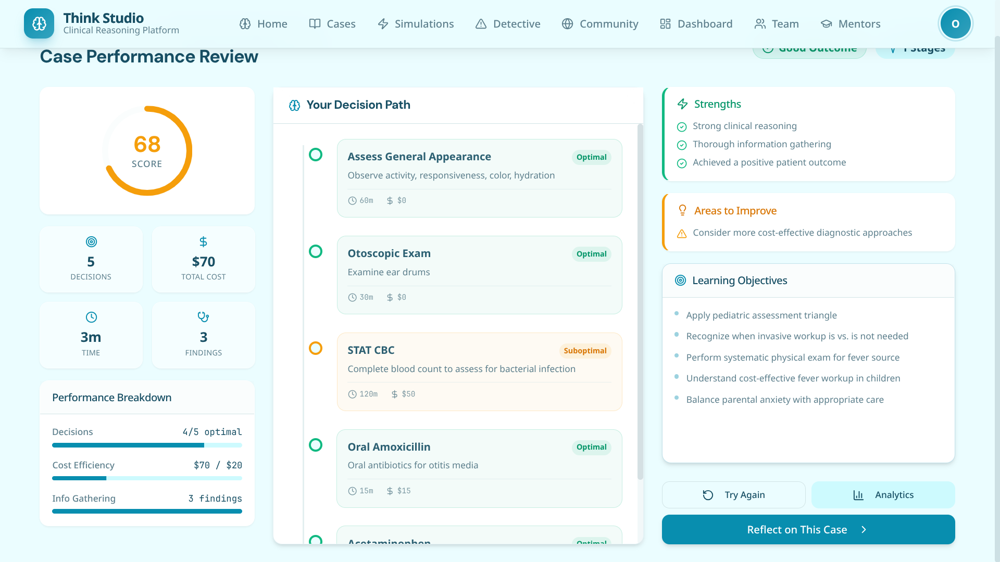

# Think Studio
Think Studio is an interactive simulation platform built to enhance clinical and medical reasoning through immersive scenarios, team collaboration, and comprehensive analytics. It provides a robust environment for educators to deploy training modules and for learners to practice decision-making in complex situations without real-world risks.

## Key Features

### Simulation Library


A comprehensive catalog of interactive modules ranging from diagnostic challenges to emergency interventions. Learners can explore various specialties and select cases that adapt to their performance and chosen difficulty level.

### Reasoning Studio


A dynamic interface designed for mapping out clinical thoughts. Users map visual connections between symptoms, findings, and potential diagnoses to build a structured approach to medical problem-solving.

### Simulation Studio


The Simulation Studio provides an adaptive environment where users engage with complex, branching clinical scenarios. Each decision impacts the patient's status, requiring learners to apply robust reasoning skills under time pressure. The interface emphasizes usability, featuring real-time vital signs and dynamic environmental feedback.

### Team Collaboration


Built for multiplayer scenarios, the Team Room allows multiple practitioners to tackle a single case simultaneously. It includes a built-in chat, synchronized scenario state, and shared decision-making tools to foster communication and collaborative problem-solving.

### Learning Analytics & Results


A comprehensive dashboard tracking long-term performance across different learning modalities, including clinical reasoning, error analysis, and uncertainty management.

### Case Performance Review


Detailed post-simulation breakdown of a user's decision path, highlighting strengths (e.g., optimal medication choices) and areas for improvement (e.g., suboptimal diagnostic tests or resource utilization). Includes an overall score and time spent.


## Technology Stack

This project is built with:
- React
- TypeScript
- Vite
- shadcn-ui
- Tailwind CSS

## Getting Started

### Prerequisites

Ensure you have Node.js and npm installed on your system.

### Installation

```bash
# Clone the repository
git clone https://github.com/bmo1177/reasoning-lab.git
cd reasoning-lab

# Install dependencies
npm install
```

### Development

```bash
# Start the development server
npm run dev
```

### Build

```bash
# Build for production
npm run build
```
